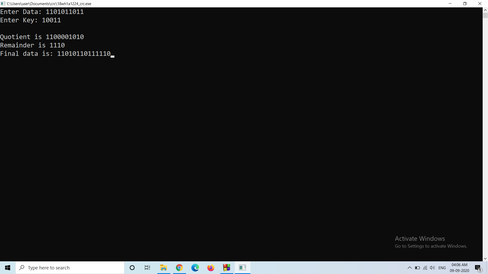

# Experiment2

## Aim of the Experiment
To compute CRC code for the polynomials CRC-12, CRC-16 and CRC CCIP

### step by step procedure of experiment
1. First we need to declare data and key required and also reading the frame and generator polynomial.
2. Then we need to scan the sizes of respected data and key bit streams.
3. After scaning we need to find the degree of polynomial and generator polynomial.
4. Next we need to repeat until the number of digits are exhausted.
5. Then printing the frames at sender sent.
6. After that printing the frames at receiver and output will be the final remainder of the crc.

### Output

