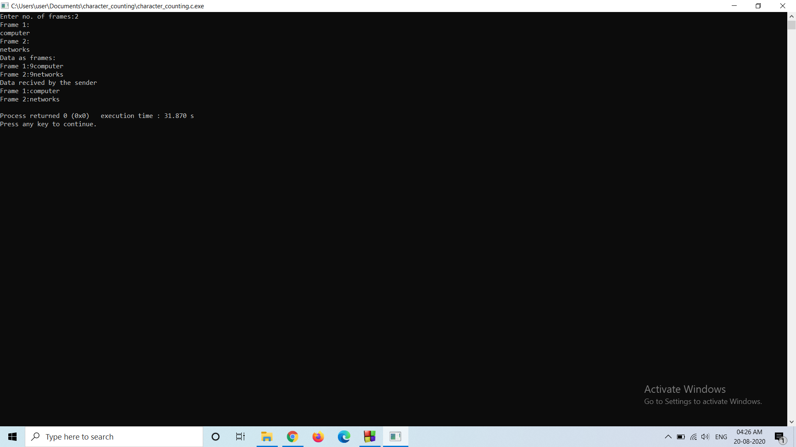
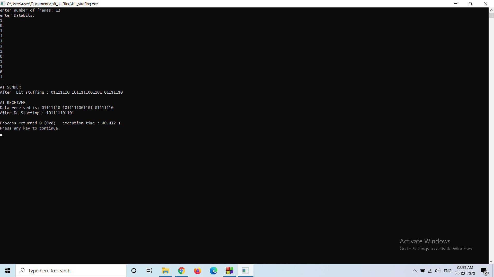
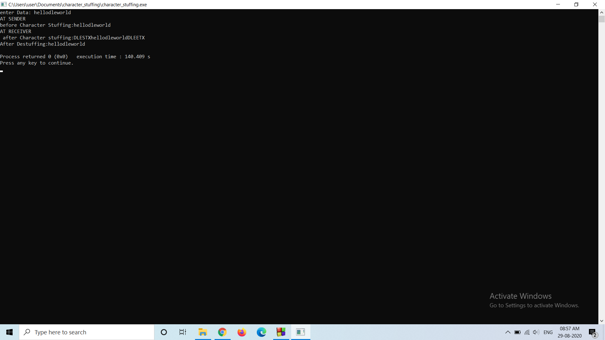

# Experiment1

## Aim of the Experiment
1. character counting
2. bit stuffing
3. character stuffing

### step by step procedure of experiment
character counting procedure
1. First we need to declare number of frames we required.
2. Then we need to scan the frames.
3. After scaning we need to find string length of the each frames.
4. Then printing the frames at sender.
5. printing the Data Transmitted.
6. After that printing the frames at receiver.

### Output

### step by step procedure of experiment
bit stuffing procedure
1. First we need to declare number of frames we required.
2. Then we need to scan the frames.
3. After scaning we need to find bits into a transmission unit as a way to provide signaling information to a receiver. 
4. Then printing the frames at sender.
5. printing the Data Transmitted.
6. After that printing the frames at receiver.

### Output

### step by step procedure of experiment
character stuffing procedure
1. First we need to declare the data we required.
2. Then we need to scan the data.
3. After scaning we need to find The sender's data layer inserts an DLE character just before the DLE character in the data.
4. Then printing the data at sender.
5. printing the Data Transmitted.
6. After that printing the data at receiver.

### Output

